# Svems Photographer


A modern photography portfolio and admin management platform built with Flask + MongoDB.


## ✨ Highlights

- Public portfolio with category-based galleries
- Contact form with server-side validation
- Secure admin authentication with `Flask-Login`
- Image upload, optimization, and category management
- Featured image toggling and bulk actions
- Admin dashboard with gallery and messages management
- Site settings editor from admin panel
- Validator unit tests included

## 🧰 Tech Stack

- **Backend:** Flask, Flask-Login, Flask-PyMongo
- **Database:** MongoDB
- **Image Processing:** Pillow
- **Auth/Security:** Werkzeug password hashing (`scrypt`), CSRF token checks
- **Runtime:** Python 3.10+ (recommended 3.11/3.12)
- **Server (production):** Gunicorn

## 🏗️ System Architecture

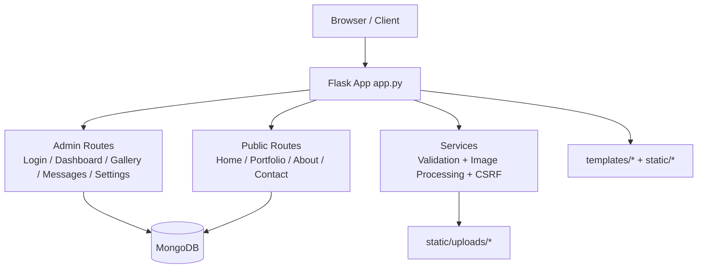

### Core Data Flow

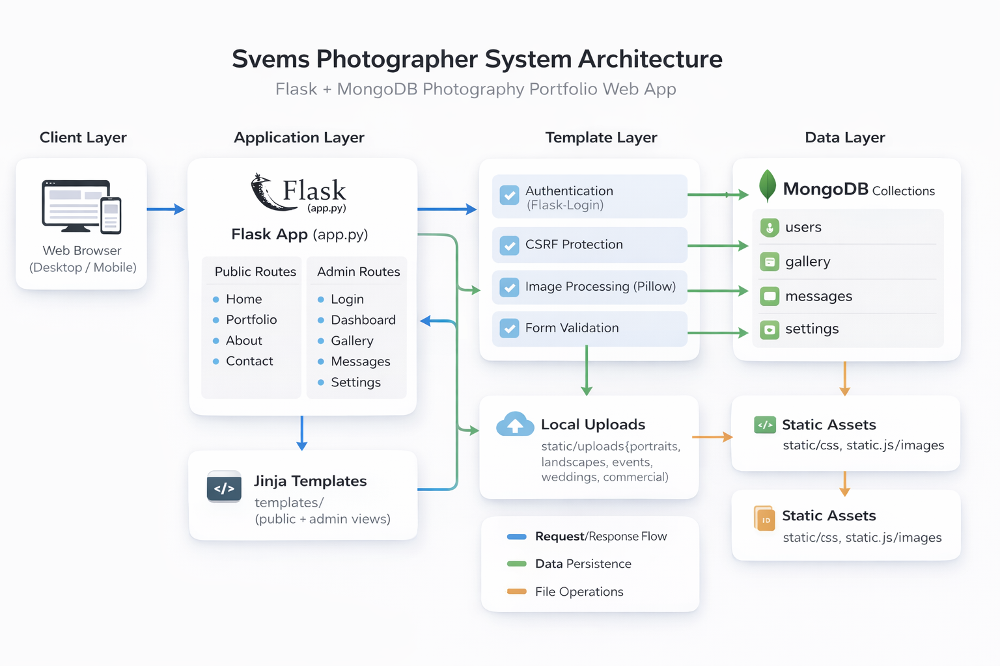

## 📁 Project Structure

```text
Svems_photographer/
|- app.py                  # Main Flask application and routes
|- config.py               # App configuration and env bindings
|- models.py               # User/Gallery model helpers
|- requirements.txt        # Python dependencies
|- init_db.py              # DB bootstrap helper
|- create_admin.py         # Creates default admin user
|- seed_db.py              # Seeds sample gallery + admin
|- templates/              # Jinja2 templates (public + admin)
|- static/
|  |- css/                 # Frontend/Admin styles
|  |- js/                  # Frontend/Admin scripts
|  |- images/              # Branding and UI assets
|  |- uploads/             # Uploaded gallery files
|- utils/                  # Validation and file handler utilities
|- tests/                  # Unit tests
```

## 🚀 Getting Started

### 1. Clone and enter project

```bash
git clone <your-repo-url>
cd Svems_photographer
```

### 2. Create virtual environment

```bash
python -m venv venv
```

Activate:

- **Windows (PowerShell):**

```powershell
.\venv\Scripts\Activate.ps1
```

- **macOS/Linux:**

```bash
source venv/bin/activate
```

### 3. Install dependencies

```bash
pip install -r requirements.txt
```

### 4. Configure environment

Create/update `.env`:

```env
SECRET_KEY=change-this-in-production
FLASK_ENV=development
FLASK_DEBUG=True
MONGO_URI=mongodb://localhost:27017/svems_photography
ADMIN_USERNAME=admin
ADMIN_EMAIL=admin@example.com
ADMIN_PASSWORD=change-this-too
```

### 5. Initialize data

```bash
python init_db.py
python seed_db.py
# Optional helper:
python create_admin.py
```

### 6. Run app

```bash
python app.py
```

App URLs:

- Public site: `http://localhost:5000/`
- Admin login: `http://localhost:5000/admin/login`

## 🔑 Default Dev Admin (from seed/helpers)

- Username: `pulindu`
- Password: `admin123`

Use only for local development. Change credentials before any deployment.

## 🧪 Run Tests

```bash
python -m unittest discover -s tests -p "test_*.py"
```

## 🧭 Git Setup and Workflow

### Initialize Git (if needed)

```bash
git init
git add .
git commit -m "Initial commit"
```

### Connect remote and push

```bash
git remote add origin <your-github-repo-url>
git branch -M main
git push -u origin main
```

### Recommended day-to-day flow

```bash
git checkout -b feature/readme-improvements
git add .
git commit -m "docs: improve project readme"
git push -u origin feature/readme-improvements
```

## 🖼️ Screenshots

### Screenshot 1

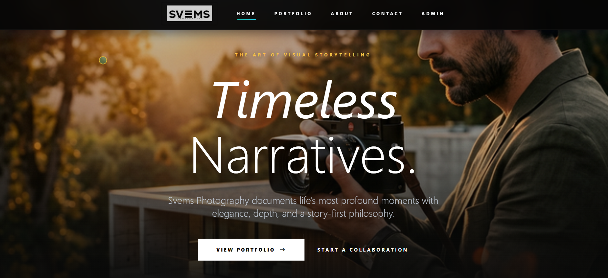

### Screenshot 2

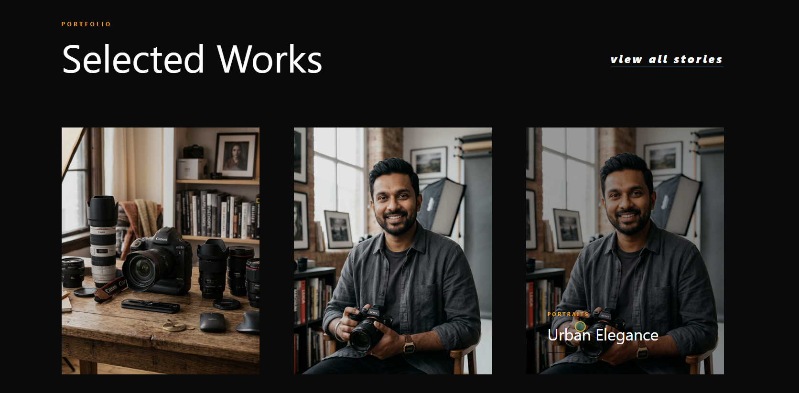

### Screenshot 3

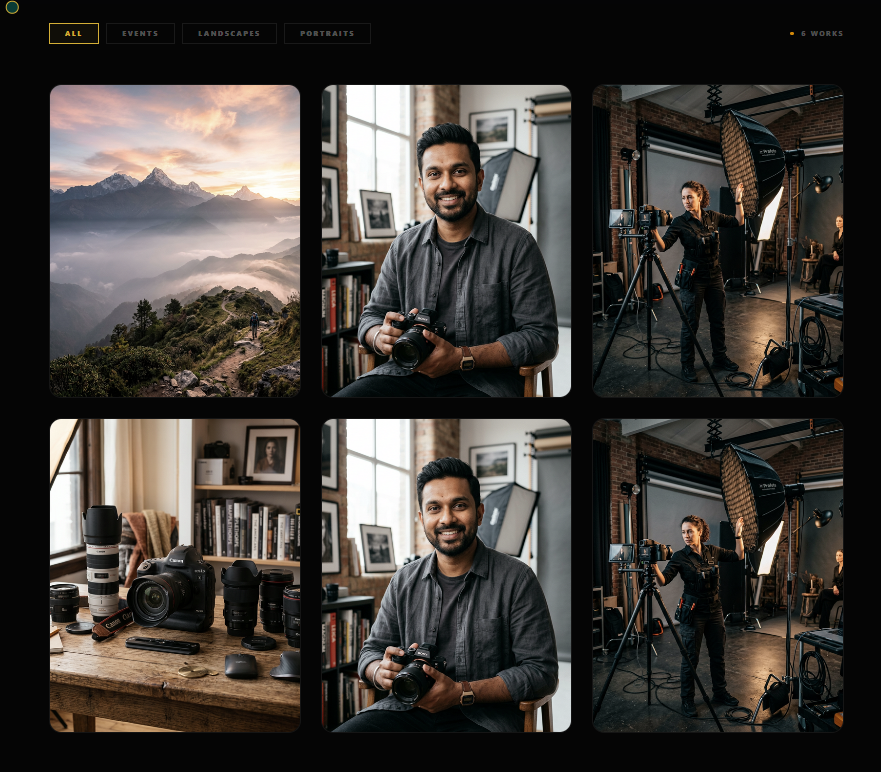

### Screenshot 4

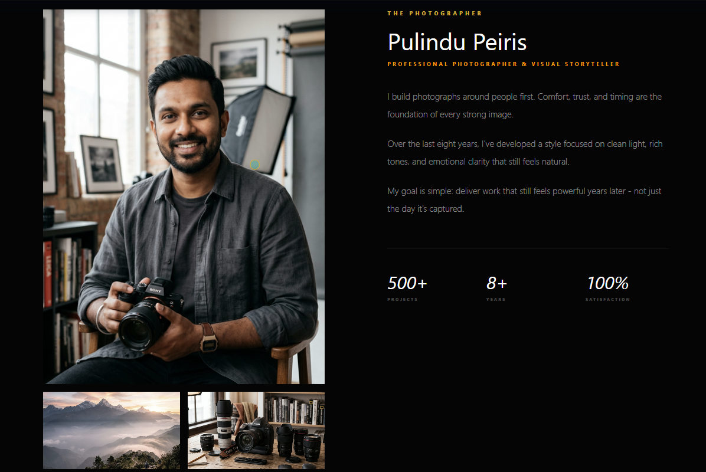

### Screenshot 5

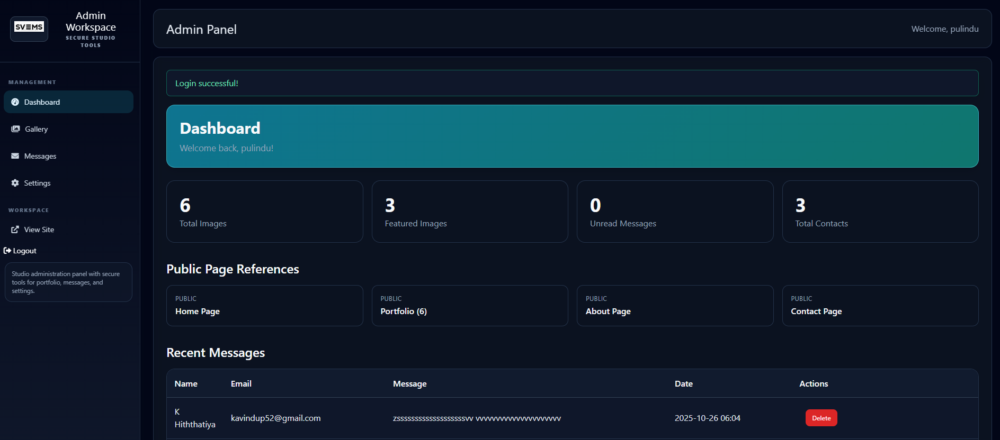

### Screenshot 6

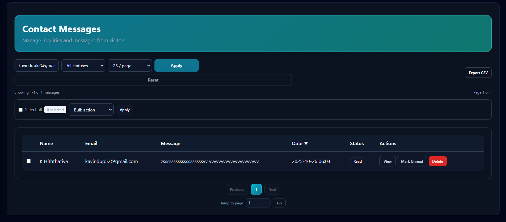

### Screenshot 7

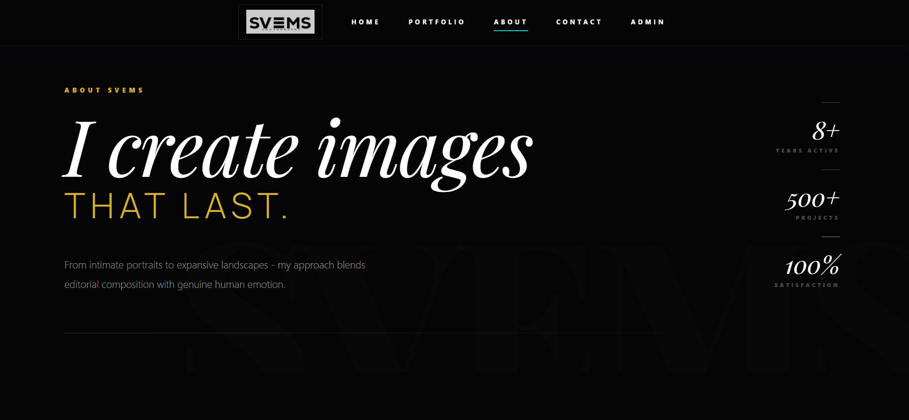

### Screenshot 8

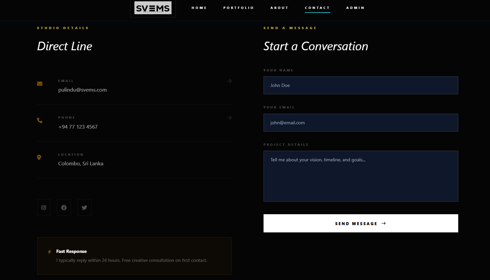

### Screenshot 9

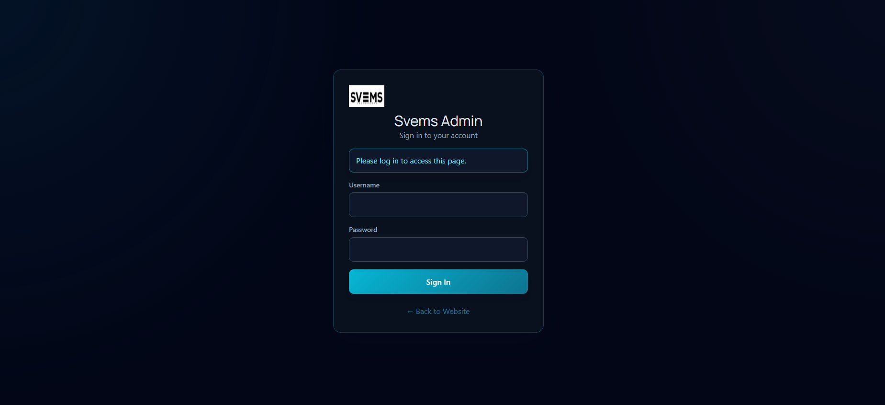

## 🌐 Key Routes

### Public

- `GET /`
- `GET /portfolio`
- `GET /about`
- `GET|POST /contact`

### Admin

- `GET|POST /admin/login`
- `GET /admin/dashboard`
- `GET|POST /admin/gallery`
- `GET /admin/messages`
- `GET|POST /admin/settings`
- `POST /admin/logout`

## 🔒 Security Notes

- Passwords are hashed with Werkzeug `scrypt`.
- CSRF token validation is implemented for form actions.
- File uploads are restricted by extension and processed before save.
- Keep `.env` private and never commit real production secrets.


